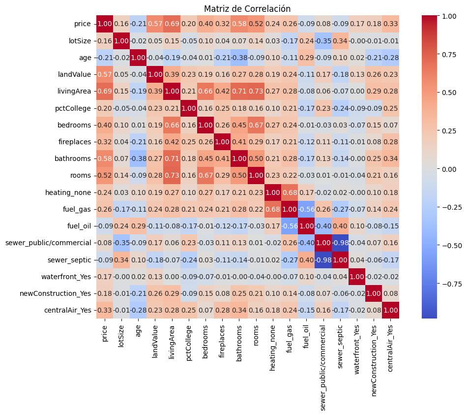
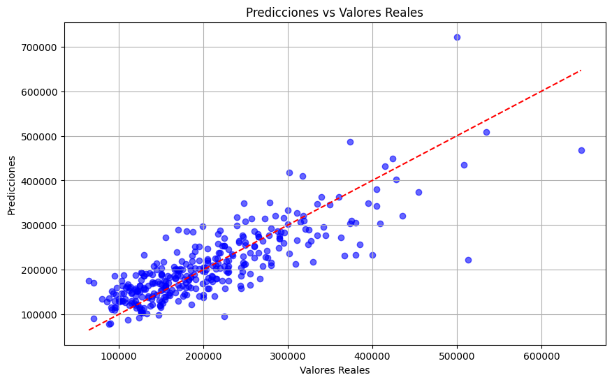
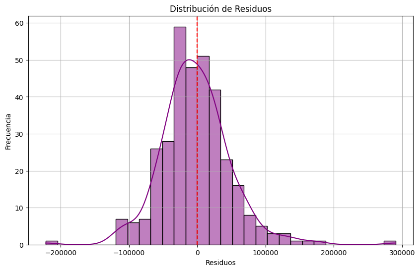
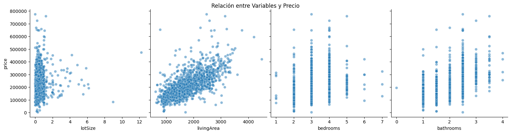

# Proyecto de Predicción de Precios de Departamentos 📊

## 1. Introducción
En este proyecto, se ha desarrollado un modelo de regresión lineal para predecir el precio de propiedades residenciales utilizando el dataset Saratoga Houses. El objetivo principal es entender cómo las características de las casas, como el tamaño del lote, área habitable, número de dormitorios y baños, entre otros, afectan el precio de venta de las propiedades. El modelo se ha entrenado y evaluado utilizando un conjunto de entrenamiento y de prueba para determinar su precisión y desempeño.

## 2. Pasos del Análisis 🔧
**Cargar y Limpiar los Datos**: Se cargaron los datos desde un archivo Excel y se realizó la limpieza de los mismos, eliminando valores nulos y estandarizando las variables categóricas como el tipo de calefacción. Además, las variables categóricas fueron convertidas a dummies para su uso en el modelo de regresión.

**Matriz de Correlación:** Se generó una matriz de correlación entre las variables numéricas para identificar relaciones entre las características de las propiedades y el precio. Esto nos permitió identificar variables que podrían tener un mayor impacto en el precio de las propiedades.

**Modelo de Regresión Lineal:** Se utilizó el algoritmo de regresión lineal para ajustar un modelo utilizando el conjunto de entrenamiento. Luego, se evaluó el modelo utilizando el conjunto de prueba y se calcularon los valores de R² y RMSE para medir su precisión y el error promedio.

## 3. Resultados 📊
* **R² (Coeficiente de Determinación):** El valor obtenido de R² fue de **0.6729**, lo que significa que el modelo es capaz de explicar el **67.29%** de la variabilidad en los precios de las propiedades en función de las características incluidas.
* **RMSE (Raíz del Error Cuadrático Medio):** El RMSE fue de **51,450.27**, lo que sugiere que, en promedio, el modelo tiene un margen de error de aproximadamente **51,450 dólares** en las predicciones de los precios de las casas.

### Ejemplos de Predicciones Generadas por el Modelo
| Real     | Predicción | Diferencia  |
|----------|------------|-------------|
| 229,000  | 193,347.04 | 35,652.96   |
| 120,975  | 114,042.81 | 6,932.19    |
| 150,000  | 127,908.34 | 22,091.66   |
| 64,500   | 174,662.41 | -110,162.41 |
| 170,000  | 165,099.97 | 4,900.03    |
| 154,000  | 138,597.52 | 15,402.48   |
| 137,000  | 118,731.44 | 18,268.56   |
| 121,000  | 151,029.26 | -30,029.26  |
| 302,000  | 236,785.36 | 65,214.64   |
| 335,000  | 277,167.70 | 57,832.30   |

## 4. Interpretación de los Gráficos 🔍
1. **Matriz de Correlación:**
     
   Se muestra la relación entre las variables numéricas.

2. **Predicciones vs Valores Reales:**
     
   Este gráfico de dispersión compara las predicciones del modelo con los valores reales.

3. **Distribución de Residuos:**
     
   Este histograma muestra cómo se distribuyen los residuos.

4. **Relación entre Variables y Precio:**
     
   Este gráfico relaciona distintas características de las propiedades con sus precios.

## 5. Conclusiones 🏁
En este proyecto se desarrolló y evaluó un modelo de regresión lineal para predecir el precio de las casas en Saratoga, logrando un valor de **R² = 0.6729**, lo que indica que el **modelo puede explicar el 67.29%** de la variabilidad en los precios de las propiedades según sus características. El RMSE obtenido fue de **51,450.27**, lo que sugiere un margen de error moderado en las predicciones.

Probamos otros modelos, como **Árboles de Decisión y Random Forest**, pero estos no ofrecieron un desempeño significativamente mejor que la regresión lineal en este conjunto de datos. La simplicidad y la interpretabilidad de la regresión lineal la hicieron el modelo más adecuado para este proyecto.

A pesar de que la regresión lineal fue el mejor modelo, las predicciones pueden variar considerablemente en algunos casos, lo que indica que podría mejorarse utilizando variables adicionales o técnicas más avanzadas, especialmente para capturar la complejidad en los datos.

